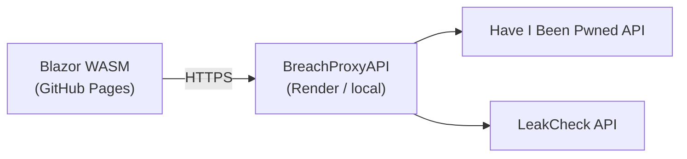

# BreachExplorer

BreachExplorer is a **Blazor WebAssembly** dashboard for exploring public breach data and checking whether an email appears in known leaks. The frontend talks to a small **ASP.NET Core proxy API** (to avoid browser CORS limits) that forwards requests to [Have I Been Pwned?](https://haveibeenpwned.com/) and enriches email lookups with [LeakCheck](https://leakcheck.io/) sources.

| | |
|---|---|
| **Live app** | https://vladpocris.github.io/BreachExplorer/ |
| **API (Render)** | https://breachexplorer.onrender.com |
| **Source** | https://github.com/VladPocris/BreachExplorer |

> **Note:** The hosted API runs on Render’s free tier. The first request after idle can take **up to ~50 seconds** while the instance wakes; later requests are much faster. Some HIBP endpoints require a paid API key, so production behavior may be limited without valid keys.

## Features

- **Latest breach** — Highlights the most recent verified breach with logo, record count, and description.
- **Top breaches chart** — Bar chart of the largest breaches (top 15), with horizontal/vertical layout toggle.
- **Custom breach chart** — Search by domain/name and add or remove bars dynamically.
- **Email breach check** (`/Breached`) — LeakCheck discovery plus HIBP enrichment per source.
- **Password generator** — Configurable length, numbers, and special characters (generated server-side).

## Architecture



| Project | Path | Role |
|---------|------|------|
| **BreachExplorer** | `src/BreachExplorer/` | Blazor WASM UI (.NET 8, Blazor.Bootstrap) |
| **BreachProxyAPI** | `src/BreachProxyAPI/` | CORS-friendly API proxy (`BreachList` assembly) |
| **docs/** | `docs/` | Static publish output for GitHub Pages |
| **tests/** | `tests/PlaywriteTesting/` | Playwright + MSTest UI tests |

## Prerequisites

- [.NET 8 SDK](https://dotnet.microsoft.com/download/dotnet/8.0)
- API keys (for full functionality):
  - **HIBP** — `KEY_BREACH_API` ([HIBP API key](https://haveibeenpwned.com/API/Key))
  - **LeakCheck** (optional for email check) — configured via `URL_LEAKCHECK_API` if needed

## Quick start (local)

### 1. Clone and configure the API

```bash
git clone https://github.com/VladPocris/BreachExplorer.git
cd BreachExplorer
```

In `src/BreachProxyAPI/`, create a `.env` file (gitignored):

```env
KEY_BREACH_API=your_hibp_api_key
URL_BREACH_API=https://haveibeenpwned.com/api/v3
# URL_LEAKCHECK_API=https://leakcheck.io/api/   # optional override
```

### 2. Run the proxy API

```bash
dotnet run --project src/BreachProxyAPI/BreachList.csproj
```

Default URL: **http://localhost:5194** (Swagger at `/swagger` in Development).

### 3. Point the frontend at the API

Edit `src/BreachExplorer/wwwroot/env.json`:

```json
{
  "URL_BACKEND_API": "http://localhost:5194"
}
```

### 4. Run the Blazor app

```bash
dotnet run --project src/BreachExplorer/BreachExplorer.csproj
```

Default URLs: **https://localhost:7043** and **http://localhost:5241** (see `Properties/launchSettings.json`).

## API endpoints

Base path: `/api/Breaches`

| Method | Route | Description |
|--------|--------|-------------|
| `GET` | `latestbreach` | Latest verified breach (HIBP proxy) |
| `GET` | `breaches` | All breaches (HIBP proxy) |
| `GET` | `breach/{name}` | Single breach details (HIBP proxy) |
| `GET` | `breachedaccount/{email}` | Raw HIBP account lookup |
| `GET` | `check/{email}` | LeakCheck + HIBP enriched result |
| `GET` | `generate-password` | Query: `length`, `includeNumbers`, `includeSpecialChars` |

Example:

```
https://breachexplorer.onrender.com/api/Breaches/check/user@example.com
```

## Deployment

| Component | Host | Notes |
|-----------|------|--------|
| **Frontend** | GitHub Pages (`docs/` or publish to `docs`) | Set `wwwroot/env.production.json` → `URL_BACKEND_API` to your API URL |
| **API** | [Render.com](https://render.com) (Docker) | Uses `src/BreachProxyAPI/Dockerfile`; set env vars in the Render dashboard |

**Deployment history:** Originally on Azure Blob static site + Azure Web App; migrated to GitHub Pages + Render when the student Azure account closed.

## Tests

```bash
dotnet test tests/PlaywriteTesting/PlaywriteTesting.csproj
```

Playwright tests cover navigation, breach lookup UI, and password generation flows.

## Tech stack

- .NET 8, Blazor WebAssembly, ASP.NET Core Web API
- [Blazor.Bootstrap](https://github.com/vikramlearning/blazorbootstrap) 3.x
- Have I Been Pwned API v3, LeakCheck public check
- Playwright + MSTest for E2E tests

## License

See repository license file if present; otherwise treat as personal/portfolio project.

---

## README history

The section below preserves the earlier README text for reference.

<details>
<summary>Original README (click to expand)</summary>

# BreachExplorer

BreachExplorer is a small Blazor WebAssembly app that lets you **see the biggest data‑breaches in one glance and check if your own e‑mail address has been pwned**. It pulls breach data from *Have I Been Pwned?* and serves it through a tiny ASP.NET Core Web API proxy (to dodge CORS), then renders interactive charts right in the browser.

**Live demo (OLD):** https://gcstorageacc2.z9.web.core.windows.net/  (Student account closed therefore deployment migrated to GitHub & render.com)
**Live demo (NEW):** https://vladpocris.github.io/BreachExplorer/    (API's were premium so at the moment some don't work or have limited functionality. FIRST API REQUESTS TAKE UP TO 50 SECONDS BECAUSE OF Render.com FREE HOSTING PLAN, THEN IT WORKS AS INTENDED)
**Source:** https://github.com/VladPocris/BreachExplorer

## What it does
- Shows the *latest* verified breach with full details.
- Interactive bar chart of the top 15 breaches, toggle horizontal / vertical.
- Custom chart: search any breached domain, add / remove bars on the fly.
- “Was I Breached?” lookup for your email, with friendly success or breach report.
- Optional strong‑password generator (API key‑powered).

# BreachProxyAPI Service (originally deployed on azure, now on render.com)
A proxy to bypas CORS.
**Live Endpoint:** https://breachexplorer.onrender.com/api/Breaches/breachedaccount/vpocris@gmail.com

## Quick start
```bash
git clone https://github.com/VladPocris/BreachExplorer.git
dotnet run --project src/BreachExplorer   # runs on https://localhost:5001
```

</details>
